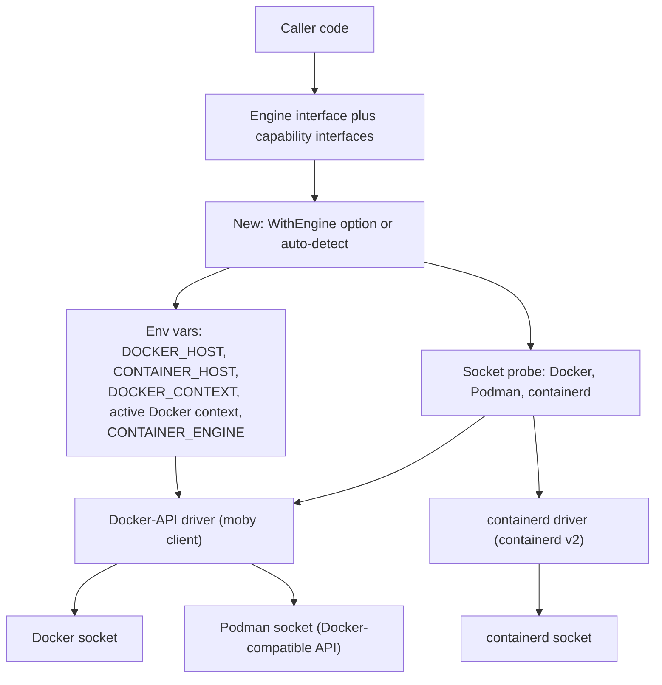

# Currus

[](https://github.com/gopherly/currus/actions/workflows/ci.yml)
[](https://codecov.io/gh/gopherly/currus)
[](https://pkg.go.dev/gopherly.dev/currus)
[](https://goreportcard.com/report/gopherly.dev/currus)
[](./LICENSE)
[](https://slack.com/app_redirect?channel=C0B50TDEKN2)

Currus is a Go package that provides a single, neutral API for running and
managing containers. It does not care which engine is installed on the host.
It detects whether Docker, Podman, or containerd is present and drives whatever
it finds through each engine's client API, so it never shells out to a CLI.
Write your container logic once against one interface; Currus adapts to whatever
runs underneath.

```bash
go get gopherly.dev/currus
```

> [!IMPORTANT]
> Requires Go 1.26 or later.

```go
import "gopherly.dev/currus"
```

## Why Currus

- One interface for Docker, Podman, and containerd. Write the code once.
- Auto-detection that pings each candidate before it trusts the socket. A stale
  socket file does not count as a live engine.
- Optional features live behind capability interfaces, so a missing feature is
  a typed `ok == false`, not a surprise at runtime.
- Errors are normalized into a small set of sentinels you can match with
  `errors.Is`.
- Built for testing: an in-memory fake and a shared conformance suite ship with
  the package.
- Native client calls only. No CLI subprocesses to install, parse, or trust.

## How it works



The Docker-API driver serves both Docker and Podman, because Podman speaks the
Docker Engine API. The containerd driver speaks the containerd v2 client API and
adapts containerd to the same neutral, Docker-like model.

## Contents

1. [Quick start](#quick-start)
2. [Auto-detection](#auto-detection)
3. [Explicit engine selection](#explicit-engine-selection)
4. [Remote and rootless engines](#remote-and-rootless-engines)
5. [Container lifecycle](#container-lifecycle)
6. [Capability interfaces](#capability-interfaces)
7. [Logging and tracing](#logging-and-tracing)
8. [Error handling](#error-handling)
9. [Testing](#testing)
10. [Engine capability matrix](#engine-capability-matrix)
11. [Examples](#examples)
12. [License](#license)
13. [Community](#community)
14. [Contributing](#contributing)

## Quick start

```go
ctx := context.Background()

// Zero-config: detects whatever engine is installed.
// MustNew panics if no engine is reachable, which is handy at startup.
// Use New when you want to handle the error yourself.
eng := currus.MustNew(ctx, currus.WithLogger(slog.Default()))
defer eng.Close()

if err := eng.PullImage(ctx, "docker.io/library/redis:7", currus.PullImageOpts{}); err != nil {
    log.Fatalf("pull: %v", err)
}

id, err := eng.CreateContainer(ctx, currus.ContainerSpec{
    Image: "docker.io/library/redis:7",
    Name:  "cache",
    Env:   []string{"REDIS_ARGS=--save 60 1"},
})
if err != nil {
    log.Fatalf("create: %v", err)
}

if err := eng.StartContainer(ctx, id); err != nil {
    log.Fatalf("start: %v", err)
}
```

> [!WARNING]
> `MustNew` panics if no engine is reachable. Use `New` when you want to
> handle the error yourself.

## Auto-detection

`New` resolves the engine in this order and returns the first one that answers
a `Ping`:

1. `DOCKER_HOST` environment variable (Docker engine; reads `DOCKER_TLS_VERIFY`
   and `DOCKER_CERT_PATH` for TLS)
2. `CONTAINER_HOST` environment variable (Podman engine)
3. `DOCKER_CONTEXT` environment variable (reads Docker context metadata)
4. Active context from `~/.docker/config.json` (skipped when `"default"` or absent)
5. `CONTAINER_ENGINE` environment variable (`docker`, `podman`, or `containerd`)
6. Docker socket (`/var/run/docker.sock`, then `~/.docker/run/docker.sock`)
7. Podman rootless socket (`$XDG_RUNTIME_DIR/podman/podman.sock` or
   `~/.local/share/containers/podman/machine/podman.sock`)
8. Podman rootful socket (`/run/podman/podman.sock`)
9. containerd socket (`/run/containerd/containerd.sock`)

Each candidate is validated with `Ping` before it is returned. A stale socket
file that no daemon is listening on does not count as a live engine.

`DOCKER_HOST` and `DOCKER_CONTEXT` are mutually exclusive. Setting both returns
an error.

## Explicit engine selection

```go
eng, err := currus.New(ctx, currus.WithEngine(currus.Podman))
```

Available `EngineKind` values: `currus.Docker`, `currus.Podman`,
`currus.Containerd`.

## Remote and rootless engines

Use `WithEndpoint` to point at a non-default socket or a remote daemon. The
`Endpoint` type supports several URI schemes:

```go
// Remote Docker over TCP with mutual TLS.
eng, err := currus.New(ctx,
    currus.WithEngine(currus.Docker),
    currus.WithEndpoint(currus.Endpoint{
        Host: "tcp://docker-host:2376",
        TLS: &currus.TLSConfig{
            CACert: caCertPEM,
            Cert:   certPEM,
            Key:    keyPEM,
        },
    }),
)
```

Supported schemes:

- `unix:///var/run/docker.sock` for a local socket (the default)
- `tcp://host:2376` for a remote daemon over TCP (use `TLSConfig` for mutual TLS)
- `ssh://user@host` for a remote Podman or Docker daemon over SSH
- `npipe:////./pipe/docker_engine` for a Windows named pipe

For containerd, `Endpoint.Host` accepts either a raw socket path
(`/run/containerd/containerd.sock`) or a `unix://` URI; both forms work. Set
`Endpoint.Namespace` to pick the namespace (defaults to `default`).

Rootless Docker and rootless Podman are picked up by auto-detection through the
`XDG_RUNTIME_DIR` socket path, so they usually work with no extra configuration.

## Container lifecycle

Every `Engine` supports the universal container lifecycle:

```go
eng.PullImage(ctx, ref, currus.PullImageOpts{})
id, _ := eng.CreateContainer(ctx, currus.ContainerSpec{Image: "nginx:latest"})
eng.StartContainer(ctx, id)
eng.StopContainer(ctx, id, currus.StopContainerOpts{Timeout: 10 * time.Second})
eng.RemoveContainer(ctx, id, currus.RemoveContainerOpts{Force: true})
containers, _ := eng.ListContainers(ctx, currus.ListContainersOpts{All: true})
```

## Capability interfaces

Not every engine supports every feature, so non-universal features live behind
optional capability interfaces. You discover them at runtime with a type
assertion. This lets you branch cleanly instead of assuming a feature is there:

```go
// Logs: containerd has no native container logs.
if lg, ok := eng.(currus.Logger); ok {
    rc, _ := lg.ContainerLogs(ctx, id, currus.ContainerLogsOpts{Follow: false, Tail: 100})
    defer rc.Close()
    io.Copy(os.Stdout, rc)
}

// Exec
if ex, ok := eng.(currus.Execer); ok {
    ex.Exec(ctx, id, currus.ExecOpts{Cmd: []string{"redis-cli", "ping"}})
}
```

The full set of capability interfaces:

| Interface           | What it does                                  |
|---------------------|-----------------------------------------------|
| `Logger`            | read container log streams                    |
| `Execer`            | run a command inside a container              |
| `Inspector`         | read full container metadata                  |
| `Stater`            | read point-in-time CPU and memory usage       |
| `Waiter`            | block until a container exits                 |
| `Eventer`           | subscribe to engine lifecycle events          |
| `Imager`            | list, remove, and tag images                  |
| `Networker`         | create, list, and remove networks             |
| `Volumer`           | create, list, and remove named volumes        |
| `Copier`            | copy files into and out of a container        |

For traits that are not method-shaped, call `eng.Capabilities()`. It returns a
`Caps` value with these fields:

- `RootlessCapable` reports whether the driver runs rootless.
- `SupportsPods` reports whether the engine groups containers into pods.
- `OneShotRun` reports whether the engine can run a container in a single call.
- `NamespaceModel` names the isolation model, for example `"containerd"`.

## Logging and tracing

Pass a `*slog.Logger` with `WithLogger` to see structured debug output for each
operation. Pass an OpenTelemetry `TracerProvider` with `WithTracerProvider` to
wrap each engine call in a span named `currus.<method>`:

```go
eng, err := currus.New(ctx,
    currus.WithLogger(slog.Default()),
    currus.WithTracerProvider(tp),
)
```

## Error handling

Currus normalizes engine errors into a small, stable set of sentinels you can
match with `errors.Is`:

```go
if err := eng.RemoveContainer(ctx, id, currus.RemoveContainerOpts{Force: true}); err != nil {
    if errors.Is(err, currus.ErrNotFound) {
        // already gone, which is fine
    } else {
        return fmt.Errorf("remove container: %w", err)
    }
}
```

Sentinel errors: `ErrNotFound`, `ErrAlreadyExists`, `ErrConflict`,
`ErrNotImplemented`, `ErrUnsupported`, and `ErrNoEngine` (returned by `New`
when no reachable engine is found).

## Testing

Swap the real engine for an in-memory fake in your tests, so you need no daemon:

```go
import "gopherly.dev/currus/currustest"

func TestStartsCache(t *testing.T) {
    eng := currustest.New() // *currustest.Fake: implements Engine and every capability interface
    // ... drive the same code path against the fake ...
}
```

The [`conformance`](conformance/) package holds a shared behavioural test suite
that checks any `Engine` against the neutral contract. It runs against the
in-memory fake on every unit run, and against real daemons in the integration
layer:

```go
func TestConformance(t *testing.T) {
    conformance.Run(t, func(t *testing.T) currus.Engine {
        return currustest.New()
    })
}
```

## Engine capability matrix

`Yes` means the engine implements the interface. `No` means a type assertion to
that interface returns `ok == false`.

| Capability               | Docker | Podman | containerd |
|--------------------------|--------|--------|------------|
| Core lifecycle (`Engine`) | Yes    | Yes    | Yes        |
| Logs (`Logger`)          | Yes    | Yes    | No         |
| Exec (`Execer`)          | Yes    | Yes    | No         |
| Inspect (`Inspector`)    | Yes    | Yes    | No         |
| Stats (`Stater`)         | Yes    | Yes    | No         |
| Wait (`Waiter`)          | Yes    | Yes    | No         |
| Events (`Eventer`)       | Yes    | Yes    | No         |
| Images (`Imager`)        | Yes    | Yes    | No         |
| Networks (`Networker`)   | Yes    | Yes    | No         |
| Volumes (`Volumer`)      | Yes    | Yes    | No         |
| Copy files (`Copier`)    | Yes    | Yes    | No         |

> [!NOTE]
> The containerd driver implements only the core `Engine` today. containerd has
> no native container logs through its client API, and the other capabilities
> are not yet adapted to its model.

## Examples

See the [`examples/`](examples/) directory for complete runnable programs:

- `examples/basic` covers auto-detect, pull, create, start, read logs, and clean up.

Run any example with:

```bash
go run ./examples/basic/...
```

## License

Currus is released under the Apache License 2.0. See [LICENSE](LICENSE).

## Community

Join `#gopherly` on the [Gophers Slack](https://gophers.slack.com).

## Contributing

```bash
nix develop          # enter the dev shell (auto-loaded via .envrc + direnv)
nix run .#lint       # run golangci-lint
nix run .#fmt        # auto-fix formatting
nix run .#test-unit  # run unit tests (no daemon required)

# run integration tests against a real engine:
CURRUS_TEST_ENGINE=docker nix run .#test-integration
CURRUS_TEST_ENGINE=podman nix run .#test-integration
```
